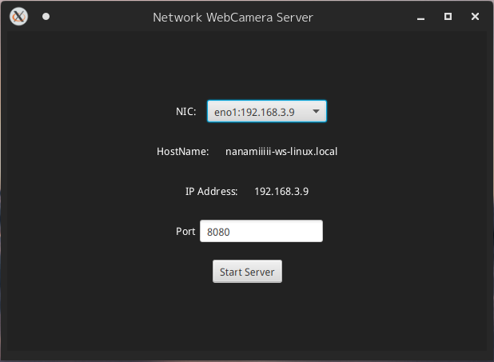
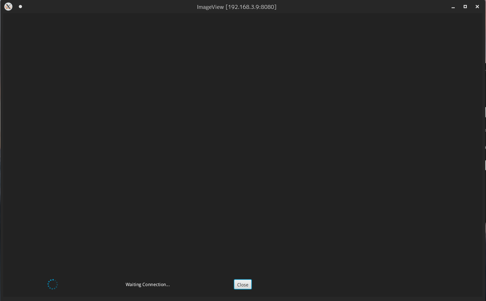
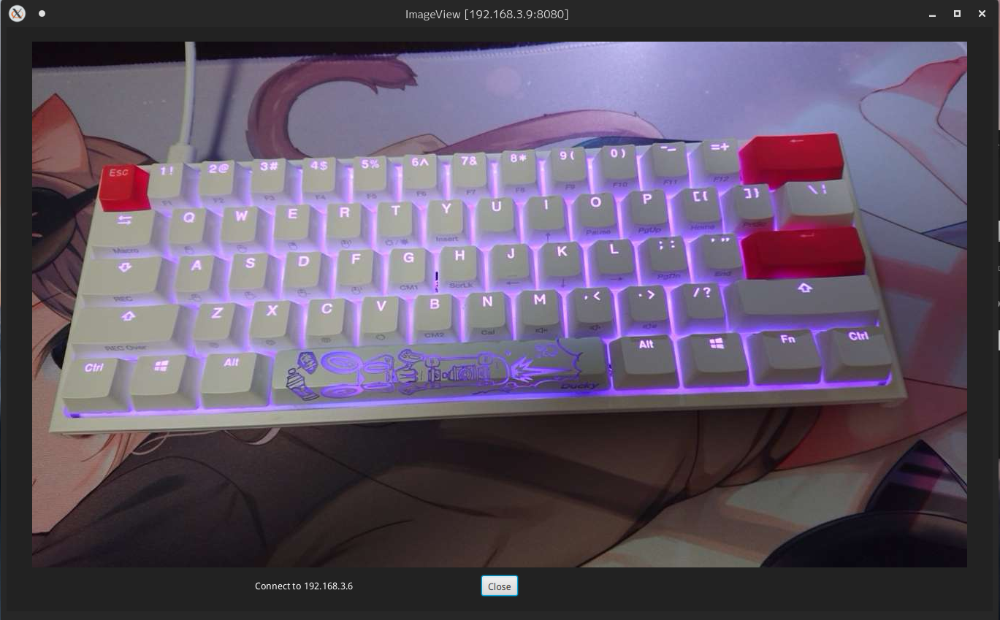

# NetworkWebCameraHost
スマートフォンからSocket通信でJPEGバイト列を受取り，画面に連続表示する  
送信側アプリは https://github.com/Nanamiiiii/NetworkWebCamera  
仕様に従っていれば，他アプリケーションからも受信可

## 使用方法

### 必須要件
- OS: Linux, Win, Mac (Linux, Winは動作確認済み)
- OpenJDK Java Runtime 15以上

### 操作
jarから起動後，端末のローカルIPアドレス確認を兼ねて，ドロップダウンリストから適当なNICを選択．  
使用ポートも指定し，[Start Server] を押すと，ウィンドウが開き受信待機状態になる．  
その後クライアントアプリ側から接続があり，データを受信するとImageViewが更新される．  
[Close] ボタンで現セッションを切断できる．

## スクリーンショット

<center>





</center>

## 仕様概要
Socketを介してバイト列を受け取る．  
受け取るバイト列は，
```
0xff + 画像サイズ<4byte> + 画像バイト配列
```
画像バイト列はJPEGバイト配列 
クライアント側から切断された場合は自動的に受信終了する．


## 開発

### 環境
- Manjaro Linux (Linux 5.10.42-1)

### 使用言語・ツール等
- Intellij IDEA Ultimate 2021.1.2
- OpenJDK 15.0.2
- OpenJFX 16
- Gradle 6.8

## To Build
仕様上はどのOSからも可能

### Intellij IDEAからビルド
IDEがGradleを認識して走らせてくれるので確実．
1. JDK 15とIntellij IDEAを導入して，プロジェクトを読み込む．  
1. Project StructureでJDK 15を選択
1. gradleを認識していると，右側にgradleタブがあるので開き，Taskの中からbuildを探して実行

### Gradleで手動ビルド
Gradle Wrapperを直接使う. Gradleバージョンの制約により，JDK16以上ではビルド不可
1. JDK 15を導入してデフォルトにしておく．
1. シェルスクリプトのgradlewに実行権限を与え，`./gladlew build` を実行  
Windowsの場合はシェルスクリプトではなくバッチファイル`gradlew.bat`を実行

shadowを使用しているので，依存ライブラリを含めたfat jarも生成されます．
